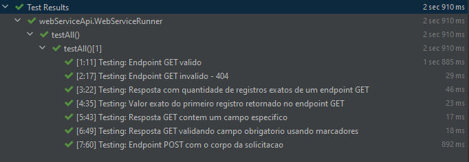

# *karate-api-test*
🎯 **Projeto contendo exemplos de teste utilizando o framework de automação Karate.**

---

## 💻 Tecnologias
Abaixo a lista de tecnologias utilizadas no projeto:
* [Karate 0.9.6](https://github.com/intuit/karate)
* [JUnit 5](https://junit.org/junit5/)
* [Gradle 7.1](https://docs.gradle.org/7.1/release-notes.html)
* [Java JDK 11](https://jdk.java.net/11/)

### 🛠️ Plugins instalados no IntelliJ
* [Karate](https://plugins.jetbrains.com/plugin/19232-karate)

---

## 🔨 Pré Condição 
Temos exemplos de teste validando 3 aplicações diferentes, segue eles com o passo a passo para subir local
* [WebService Kotlin](https://github.com/diegomachadoti/webService-restAssured-test)
* [WebService Serverest](https://serverest.dev/)
* [WebService em Java Script](https://github.com/diegomachadoti/api-full-stack-be-fe)

## Estrutura dos testes
Os testes estão estruturados em `src/main/test`, onde encontramos basicamente:
- `src/main/test/kotlin/webServiceApi` Path contendo todos os arquivos de teste da funcionalidade:

- `src/main/test/kotlin/karate-config.js` arquivo onde são definidas diversas configurações do Karate, como por exemplo, ambiente de teste, parâmetros dinâmicos, informações de acesso, variáveis globais, etc.

---
## 🚀 Executando os testes
Abaixo as informações necessárias para execução dos testes:
- Na classe `RunnerTest.kt` opção botão direito Run, roda todos os testes.

- Rodar testes específico:
    - Se utilizar o plugin do Karate no IntelliJ, através do arquivo `.feature`, é possível executar os testes.

**Executar teste via linha de comando por tags**
> ./gradlew test -Dkarate.options="--tags @getByall classpath:webServiceTasksByJS/TasksStudy.feature"

**Executar teste via linha de comando por .feature**
> ./gradlew test -Dkarate.options="classpath:webServiceTasksByJS/TasksStudy.feature"

---
## 📊 Report dos Testes
Resultado dos testes encontra-se na pasta `karate-api-test/build/karate-reports/...`

## ☁ Analise de Código
Projeto configurado no sonarCloud
* [Sonar Cloud](https://sonarcloud.io/summary/overall?id=diegomachadoti_karate-api-test)

---
## 🔗 Referência
* [Karate Labs](https://karatelabs.github.io/karate/)
* [karate Exemplos](https://github.com/karatelabs/karate/tree/master/karate-junit4/src/test/java/com/intuit/karate/junit4/demos)
* [Start Spring IO](https://start.spring.io/)