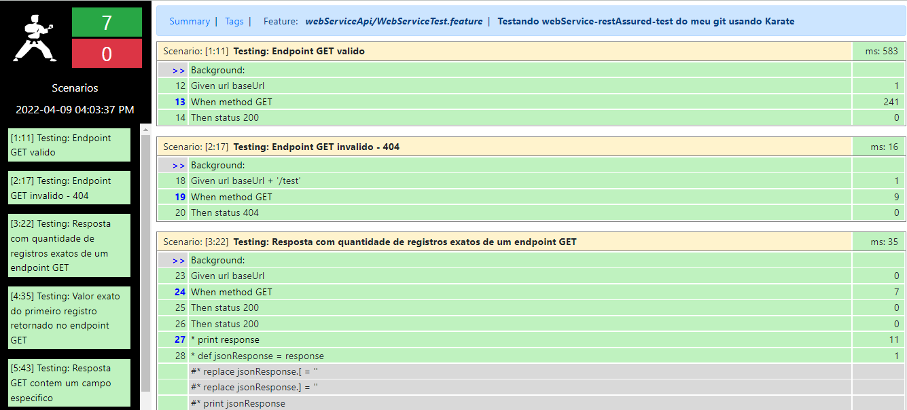

# karate-api-test
Projeto contendo exemplos de teste utilizando o framework de automação Karate.

---

## Tecnologias
Abaixo a lista de tecnologias utilizadas no projeto:
- Karate 0.9.6 (https://github.com/intuit/karate);
- JUnit 5;
- Gradle 7.1;
- Java JDK 11;

### Plugins instalados no IntelliJ
- Gherkin.
- Cucumber For Kotlin

---

## Pré Condição 
O projeto esta testando o webservice do projeto de exemplo abaixo. Com isso é necessário subir esse projeto local.
* [webService](https://github.com/diegomachadoti/webService-restAssured-test)

## Estrutura dos testes
Os testes estão estruturados em `src/main/test`, onde encontramos basicamente:
- `src/main/test/kotlin/webServiceApi` Path contendo todos os arquivos de teste da funcionalidade:

- `src/main/test/kotlin/karate-config.js` arquivo onde são definidas diversas configurações do Karate, como por exemplo, ambiente de teste, parâmetros dinâmicos, informações de acesso, variáveis globais, etc.

---

## Executando os testes
Abaixo as informações necessárias para execuçãoo dos testes:
- Na classe `WebServiceRunner.kt` opção botão direito Run.

- Observaçãoes:
    - Se utilizar o plugin do Cucumber no IntelliJ, através do arquivo `.feature`, é possével executar os testes de apenas uma feature ou atá mesmo de um scenario específico.

**Executar o teste via linha de comando por tags**
> ./gradlew test -Dkarate.options="--tags <nome_da_tag>"

**Executar o teste via linha de comando por tnome do teste .feature**
> ./gradlew test -Dkarate.options="--name '<nome_do_teste>'"

## Report dos Testes
Resultado dos testes encontra-se na pasta `karate-api-test/build/karate-reports/...`

## Analise de Código
Projeto configurado no sonarCloud
* [Sonar Cloud](https://sonarcloud.io/summary/overall?id=diegomachadoti_karate-api-test)

## Referência
* [Karate Labs](https://karatelabs.github.io/karate/)
* [karate Exemplos](https://github.com/karatelabs/karate/tree/master/karate-junit4/src/test/java/com/intuit/karate/junit4/demos)
